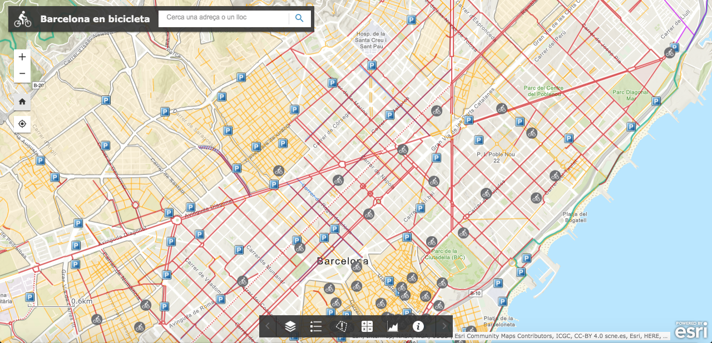

# Barcelona en bicicleta

Mapa interactiu de vies i serveis per a bicicletes a la ciutat de Barcelona.

## Objectiu

La bicicleta té un paper molt important en les ciutats del futur.
L'ús generalitzat d'aquest mitjà de transport pot suposar una aportació significativa a l'assoliment dels objectius de desenvolupament sostenible.
Potenciar la mobilitat en bicicleta ajuda a reduir les emissions i la contaminació acústica, permet aconseguir unes ciutats més segures i sostenibles, i suposa una acció important per combatre el canvi climàtic.
A més, la bicicleta promou la pràctica de l'esport i afavoreix una vida saludable, garantint la salut i el benestar dels ciutadans.

[Barcelona en bicicleta](https://storage.googleapis.com/barcelonaenbicicleta/index.html) integra en un mapa interactiu tota la informació disponible sobre l'ús de la bicicleta a Barcelona.
El seu objectiu és mostrar l'estat actual de les vies i serveis per a bicicletes i, a la vegada, motivar l'ús d'aquest sistema de transport entre els seus ciutadans.

La visualització permet explorar i analitzar la distribució de les vies per a ciclistes i tots aquells serveis relacionats amb la bicicleta.
L'anàlisi es pot realitzar de manera visual, explorant el mapa i la distribució espacial de les diferents capes, o a través de diferents gràfiques que mostren aspectes com la longitud del carril bici o el nombre de serveis per districte.
Aquesta anàlisi permet detectar zones on la mobilitat de les bicicletes resulta més difícil o que disposen de pocs serveis per a ciclistes.

D'altra banda, la visualització també proporciona una eina útil per als ciutadans que volen utilitzar la bicicleta per a desplaçar-se per la ciutat.
El mapa mostra la xarxa de carril bici, vies ciclables i zones 30, juntament amb la localització dels aparcaments i altres serveis per a bicicletes; a més, incorpora informació sobre el servei de "Bicing", com la localització de les estacions, el seu estat actual i el nombre de bicicletes disponibles a temps real.
Tota aquesta informació ha de servir per facilitar l'ús de la bicicleta a la ciutat i també per difondre i potenciar l'ús d'aquest mitjà de transport entre els seus ciutadans.

## Visualització

## Fonts de dades

* [Carrils Bici de la ciutat de Barcelona](https://opendata-ajuntament.barcelona.cat/data/ca/dataset/carril-bici)
* [Carrils Bici en construcció a la ciutat de Barcelona](https://opendata-ajuntament.barcelona.cat/data/ca/dataset/carrils-bici-en-construccio)
* [Carrils Bici d'altres municipis de l'Àrea Metropolitana de Barcelona](https://opendata-ajuntament.barcelona.cat/data/ca/dataset/carrils-bici-municipis)
* [Vies pedalables "Ciclables" a la ciutat de Barcelona](https://opendata-ajuntament.barcelona.cat/data/ca/dataset/vies-ciclables)
* [Zones 30 a la ciutat de Barcelona](https://opendata-ajuntament.barcelona.cat/data/ca/dataset/zones30-carrers)
* [Corredors bicicleta de la ciutat de Barcelona](https://opendata-ajuntament.barcelona.cat/data/ca/dataset/corredors-bici-bcn)
* [Carrers pacificats de la ciutat de Barcelona](https://opendata-ajuntament.barcelona.cat/data/ca/dataset/carrers-pacificats-bici-bcn)
* [Ronda Verda de la ciutat de Barcelona](https://opendata-ajuntament.barcelona.cat/data/ca/dataset/ronda-verda)
* [Informació de les estacions del nou Bicing de la ciutat de Barcelona](https://opendata-ajuntament.barcelona.cat/data/ca/dataset/informacio-estacions-bicing)
* [Estat de les estacions del nou Bicing de la ciutat de Barcelona](https://opendata-ajuntament.barcelona.cat/data/ca/dataset/estat-estacions-bicing)
* [Serveis relacionats amb bicicletes a la ciutat de Barcelona](https://opendata-ajuntament.barcelona.cat/data/ca/dataset/bicicletes)
* [Aparcament amb servei per a bicis a la ciutat de Barcelona](https://opendata-ajuntament.barcelona.cat/data/ca/dataset/aparcaments-servei-bicis)
* [Punts d'ancoratge de bicicletes de la ciutat de Barcelona](https://opendata-ajuntament.barcelona.cat/data/ca/dataset/punts-ancoratge-bicicletes)
* [Unitats administratives de la ciutat de Barcelona](https://opendata-ajuntament.barcelona.cat/data/ca/dataset/20170706-districtes-barris)

## Eines

* ArcGIS for developers
* Web AppBuilder
* Google Cloud Platform
* Jupyter Notebook

